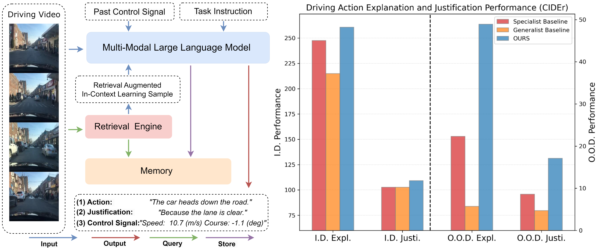

# RAG-Driver
[Arxiv](https://arxiv.org/abs/2402.10828) [Project Page](https://yuanjianhao508.github.io/RAG-Driver/)

Official GitHub repository for "RAG-Driver: Generalisable Driving Explanations with Retrieval-Augmented In-Context Learning in Multi-Modal Large Language Model " accepted by Robotics: Science and Systems (RSS) 2024.


## Highlights <a name="highlight"></a>
<p align="center">
  
</p>

**RAG-Driver** is a Multi-Modal Large Language Model with Retrieval-augmented In-context Learning capacity designed for generalisable and explainable end-to-end driving with strong zeroshot generalisation capacity.

## News <a name="highlight"></a>
* **[2024.06.13]**  Processed Version of BDD-X is available from [here](https://drive.google.com/file/d/14a3QTkWRelAZs-kW_2U5tjYcAm2l8VbF/view?usp=sharing)
* **[2024.05.29]**  Code update is in Progress, this repo is under active maintenance! Please wait for a few moments!


## TODO List
- [x] Uploading the processed version of BDDX.
- [x] Uploading evaluation pipeline
- [ ] Uploading the model checkpoint.
- [ ] Releasing Spoken-SAX dataset.
- [ ] further cleaning of retrieval engine codebase

## Usage

### Requirements and Installation
* Python >= 3.10
* Pytorch == 2.0.1
* CUDA Version >= 11.7
* Install required packages:
```bash
git clone https://github.com/YuanJianhao508/RAG-Driver.git
cd RAG-DRIVER
conda create -n ragdriver python=3.10 -y
conda activate ragdriver
pip install --upgrade pip  # enable PEP 660 support
pip install -e .
pip install -e ".[train]"
pip install flash-attn --no-build-isolation
pip install decord opencv-python git+https://github.com/facebookresearch/pytorchvideo.git@28fe037d212663c6a24f373b94cc5d478c8c1a1d tensorboardX
```

### Instruction Tuning on BDD-X dataset

```bash
bash ./scripts/finetune.sh
```

- Download pre-trained Video-LLaVA LLM and projector checkpoint from [here](https://huggingface.co/LanguageBind/Video-LLaVA-7B) and [here](https://huggingface.co/LanguageBind/Video-LLaVA-Pretrain-7B) and specify path in '--model_name_or_path' and '--pretrain_mm_mlp_adapter'.
- Download pre-trained LanguageBind encoder from [here](https://huggingface.co/LanguageBind/LanguageBind_Video_merge) and [here](https://huggingface.co/LanguageBind/LanguageBind_Image) and specify path in '--video_tower' and '--image_tower'.
- Change the batch size '--per_device_train_batch_size' and gradient accumulation step '--gradient_accumulation_steps' based on the number of gpu available, please ensure the effective batch size (i.e. --per_device_train_batch_size * gradient accumulation step * number of gpus) equals '128'.


### Evaluation
```bash
bash ./scripts/batch_inference.sh
```
- Specify path to trained model in 'MODEL_PATH'
- Specify path to evaluation file path in '--input'
- Specify path to output prediction file path in '--output'

#### Evaluate Caption Performance
Please download the following [files](https://drive.google.com/drive/folders/1LLoEyIZ2BZzTP_h93z93QAhO0Hq5_K9r) (open-sourced by ADAPT), and extract all files under folder './evalcap' .

Then, run 
'''
python evaluate.py
'''
with the prediction output file version stored in parameter 'version' in script.


## Citations
If you find our paper and code useful in your research, please consider citing:
```BibTeX
@article{yuan2024rag,
  title={RAG-Driver: Generalisable Driving Explanations with Retrieval-Augmented In-Context Learning in Multi-Modal Large Language Model},
  author={Yuan, Jianhao and Sun, Shuyang and Omeiza, Daniel and Zhao, Bo and Newman, Paul and Kunze, Lars and Gadd, Matthew},
  journal={arXiv preprint arXiv:2402.10828},
  year={2024}
}
}
```


## Acknowledgement
This repo is built on [Video-LLaVA](https://github.com/haotian-liu/LLaVA), [ADAPT](https://github.com/jxbbb/ADAPT), and [BDDX](https://github.com/JinkyuKimUCB/BDD-X-dataset). We thank all the authors for their open-sourced codebase and data!
